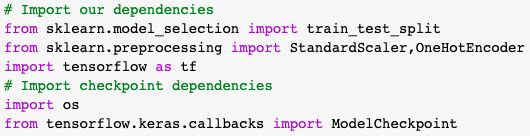
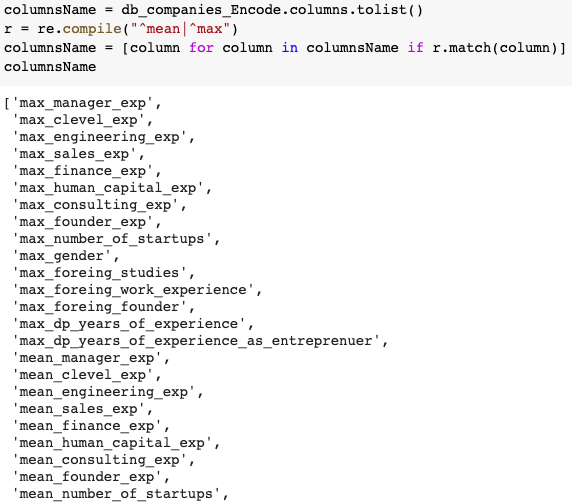
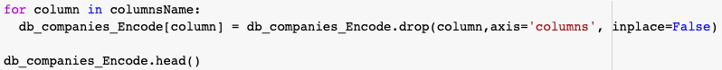
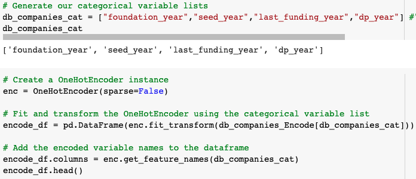
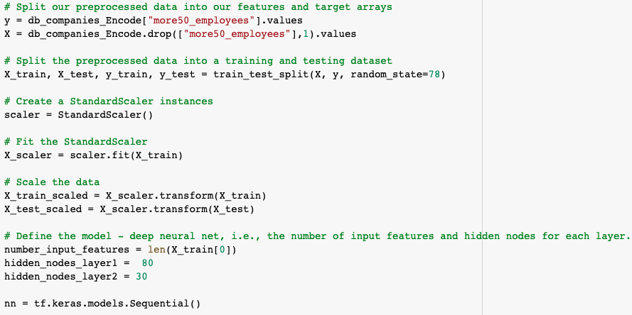
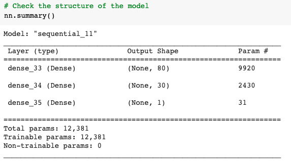
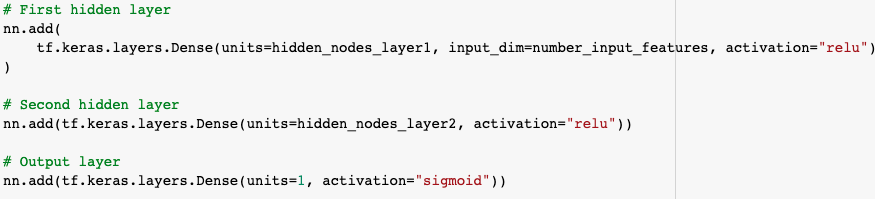
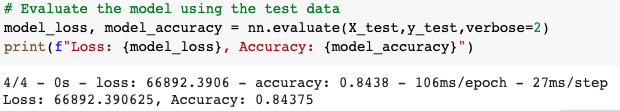
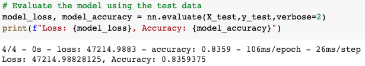
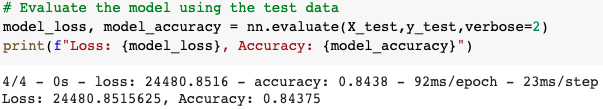

[Back to README](README.md)

# Neural networks

### Pros
    - They are versatile as they can be applied to both regression and classification problems.
    - They are good for modeling with nonlinear data with a large number of inputs.
    - They can be trained with any number of inputs and layers.

### Cons
    - The customer's explanation is difficult to make
    - They usually present over-fitting and generalization

# Data processing

The data frame is adapted to the neural network model, removing the columns with maximum and mean variables. Transforming those defined by years to categorical ones. 

## 1. Import libraries

## 2. Select category columns

## 3. Drop category columns (Mean, max)

## 4. Encode and transform years columns

_______________________________

For each Y defined as independent variable, a model of its own is created.

## 5. Slipt data

## 6. Structure module

## 7. Create and config layers

## 8. Evaluate results

### Y = +50 employees

### Y = +100 employees

### Y = soonicorns

