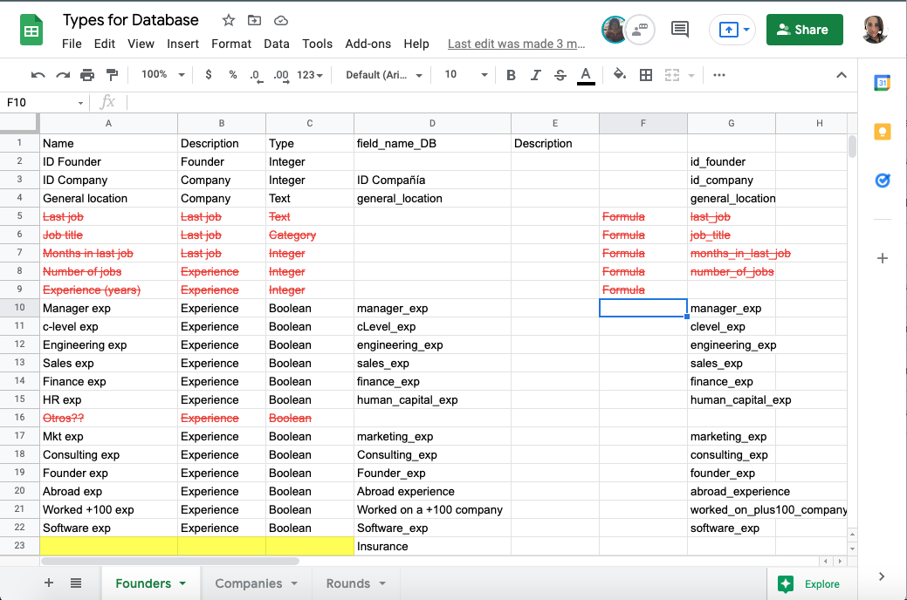

# Final project Data Bootcamp

GitHub Repository for the final project

## Overview

Presentation link:
[First Delivery Presentation](https://docs.google.com/presentation/d/1K-likYbv1rm9tx0FUCvtPsFVDtoFoNSIyFht_ey9abI/edit?usp=sharing)

__________

## Framework SCRUM

We will use the Scrum framework to carry out the project. Raquel will be the Scrum Master of the team.

## Meetings calendar

We will use the zoom for daily scrum meetings, weekdays from 6:45 pm to 7:00 pm

## Team branch

Each member of the team create personal branch on Github

______________

## Table fields review

The database fields are reviewed with the mockup fields. Type and name.

## Presentation

[First Deliverable Presentation](https://docs.google.com/presentation/d/1K-likYbv1rm9tx0FUCvtPsFVDtoFoNSIyFht_ey9abI/edit?usp=sharing)
