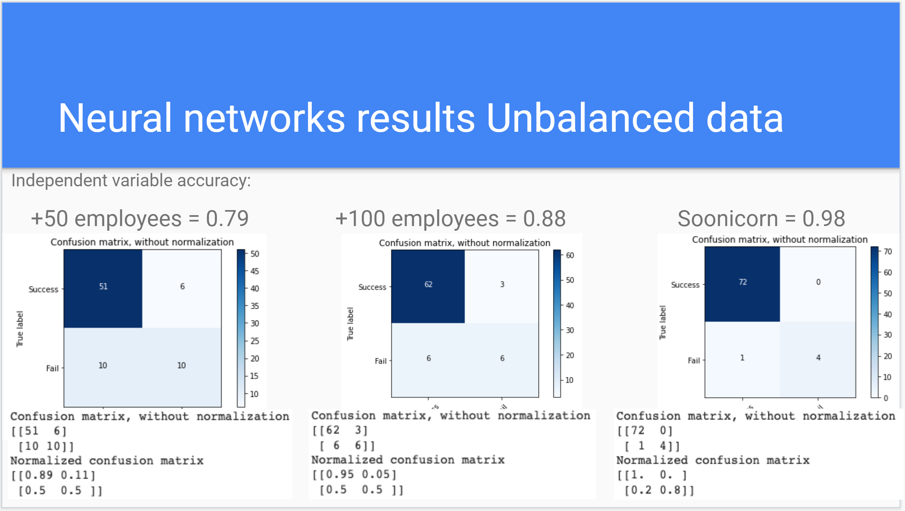
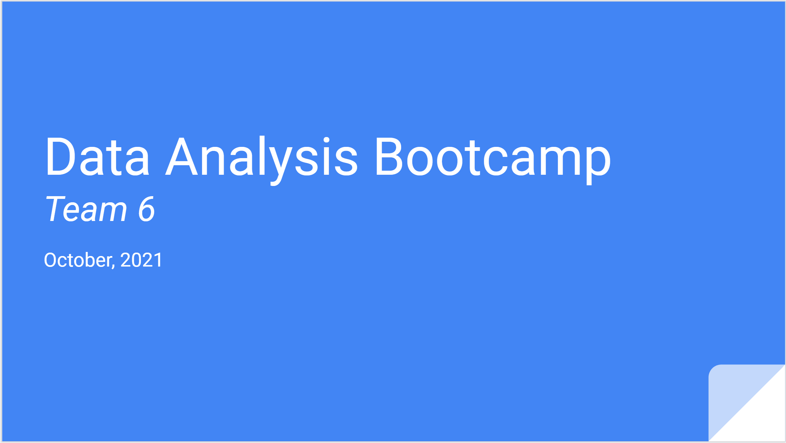

# Final project Data Bootcamp

## Index

| Topic | Description | Link | Code |
| --- | --- | :---: | :---: |
| **Presentations** | Presentations by deliverable | [Go](README.md#presentations) | - |
| **Team Organization** | Framework, Team Calendar, Branchs | [Go](RED00_Team_organization.md) | - |
| **Data Muckups** | Fields Review, Mockup tables | [Go](RED01_Data_Muckups.md) | - |
| **Database Integration** | Google Cloude Database, Tables Descriptions, Example Queries, Psycopg2 connection  | [Go](RED02_Database_Integration.md) | [<>](./Resources/code/Database_Integration_Connection_SQL.ipynb) |
| **Preprocessing** | Features calculation and consolidation, Companies Table Creation | [Go](RED03_Preprocessing.md) | [<>](./Resources/code/Data_Preprocessing_Company_Table_V02.ipynb)  |
| **Cleaning data** | Null values cleaning, Encoding | [Go](RED04_Cleaning.md) | [<>](./Resources/code/cleanData.ipynb)|
| **Exploratory analysis** | Preliminar Findings | [Go](RED05_Exploratory_analysis.md)| [<>](./Resources/code/First_exploration_data.ipynb) |
| **Principal Components Analysis** | PCA and K-means | [Go](RED07_PCA.md)| [<>](./Resources/code/Principal_Component_Analysis_V03.ipynb) |
| **Neural networks** | Pros and Cons of the Model, Preliminar Loss and Accuracy | [Go](RED06_Neuronal_networks.md)| [<>](./Resources/code/Machine_Learning_Model.ipynb) |
| **Logistic Regression** | Logistic Regression, comparison between treatments | [Go](RED08_Logistic_Regression.md) | [<>](./Resources/code/Logistic_Regression.ipynb) |
| **Random Forest** | Random Forest, comparison between models and hyperparameters | [Go](https://github.com/ENRICOROBLESDELRIO/data_boot_camp_final_project/blob/main/Random_Forest_Model_100%2B.ipynb) | [<>](https://github.com/ENRICOROBLESDELRIO/data_boot_camp_final_project/blob/main/Random_Forest_Model_50%2B.ipynb) |
| **Dashboard** | Data Exploratory with filtering "More than 50 employees" | [Go](https://public.tableau.com/app/profile/raquel.valdez.beristain/viz/BootcampFinalProject_16375307974130/Storyboard?publish=yes) | - |
---

## Presentations

[Back to Index](README.md#index)

### Third Delivery Presentation

[Go to Presentation](https://docs.google.com/presentation/d/1hwrOTmSkyvHYLXbZJylb-dQx5HRse0HwkZh29kWzUAI/edit?usp=sharing)

#### Content

✓ Selected topic

✓ Reason why they selected their topic

✓ Description of their source of data

✓ Questions they hope to answer with the data

✓ Description of the data exploration phase of the project

✓ Description of the analysis phase of the project

✓ Technologies, languages, tools, and algorithms used throughout the project

#### A blueprint for the dashboard is created and includes all of the following:

✓ Storyboard on Google Slide(s)

✓ Description of the tool(s) that will be used to create final dashboard

✓ Description of interactive element(s)

---

### Previous Presentations

  
First Delivery Presentation

  Presentation link:
  [First Delivery Presentation](https://docs.google.com/presentation/d/1K-likYbv1rm9tx0FUCvtPsFVDtoFoNSIyFht_ey9abI/edit?usp=sharing)

  

  
Second Delivery Presentation

  Presentation link:
  [Go to Presentation](https://docs.google.com/presentation/d/1T7nPs9Xw17V6-010LkOIDMzpIrChUdoW8UOq_4DVLtM/edit?usp=sharing)

  
  
  [

  #### Content

  ✓ Selected topic

  ✓ Reason why they selected their topic

  ✓ Description of their source of data

  ✓ Questions they hope to answer with the data

  ✓ Description of the data exploration phase of the project

  ✓ Description of the analysis phase of the project

  #### A blueprint for the dashboard is created and includes all of the following:

  ✓ Storyboard on Google Slide(s)

  ✓ Description of the tool(s) that will be used to create final dashboard

  ✓ Description of interactive element(s)

[Back to Index](README.md#index)
