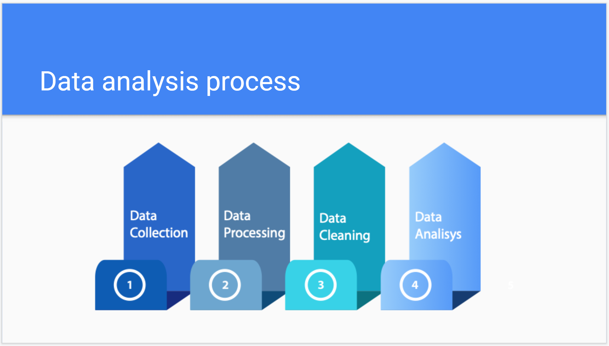
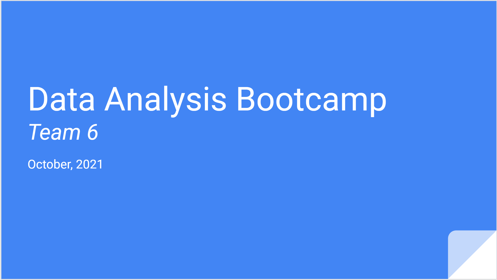

# Final project Data Bootcamp

---

## Index

| Topic | Description | Link |
| --- | --- | :---: |
| **Presentations** | Presentations by deliverable | [Go](README.md#presentations) |
| **Team Organization** | Framework, Team Calendar, Branchs | [Go](RED00_Team_organization.md) |
| **Data Muckups** | Fields Review, Mockup tables | [Go](RED01_Data_Muckups.md) |
| **Database Integration** | Google Cloude Database, Tables Descriptions, Example Queries, Psycopg2 connection  | [Go](RED02_Database_Integration.md) |
| **Preprocessing** | Features calculation and consolidation, Companies Table Creation | [Go](RED03_Preprocessing.md) |
| **Cleaning data** | Null values cleaning, Encoding | [Go](RED04_Cleaning.md) |
| **Exploratory analysis** | Preliminar Findings | [Go](RED05_Exploratory_analysis.md)|
| **Neural networks** | Pros and Cons of the Model, Preliminar Loss and Accuracy | [Go](RED06_Neural_networks.md)|

---

## Presentations

### Second Delivery Presentation

[Back to Index](README.md#index)

[Go to Presentation](https://docs.google.com/presentation/d/1T7nPs9Xw17V6-010LkOIDMzpIrChUdoW8UOq_4DVLtM/edit?usp=sharing)

Content

✓ Selected topic

✓ Reason why they selected their topic

✓ Description of their source of data

✓ Questions they hope to answer with the data

✓ Description of the data exploration phase of the project

✓ Description of the analysis phase of the project

A blueprint for the dashboard is created and includes all of the following:

✓ Storyboard on Google Slide(s)

✓ Description of the tool(s) that will be used to create final dashboard

✓ Description of interactive element(s)

---

  
First Delivery Presentation

Presentation link:
[First Delivery Presentation](https://docs.google.com/presentation/d/1K-likYbv1rm9tx0FUCvtPsFVDtoFoNSIyFht_ey9abI/edit?usp=sharing)

[Back to Index](README.md#index)
