# Final project Data Bootcamp

GitHub Repository for the final project

## Overview

Presentation link:
[First Delivery Presentation](https://docs.google.com/presentation/d/1K-likYbv1rm9tx0FUCvtPsFVDtoFoNSIyFht_ey9abI/edit?usp=sharing)

__________

## Framework SCRUM

We will use the Scrum framework to carry out the project. Raquel will be the Scrum Master of the team.

## Meetings calendar

We will use the zoom for daily scrum meetings, weekdays from 6:45 pm to 7:00 pm

## Team branch

Each member of the team create personal branch on Github

______________

## Table fields review

The database fields are reviewed with the mockup fields. Type and name.

## Mockups table

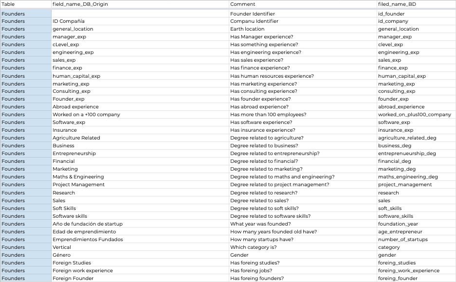
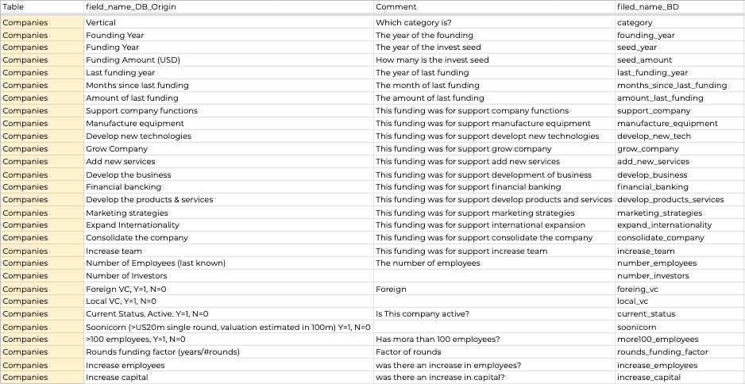
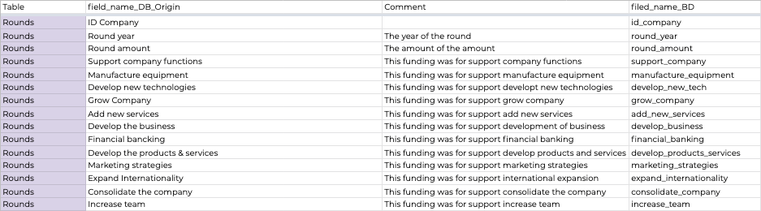

_______________
_______________

# Description of preliminary data preprocessing

# Description of cleaning data
The connection to the postgress database was made to google colab.

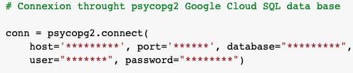

In each of the tables (Founders and Rounsds) the following steps are performed:

- Put the SQL table in a DataFrame.

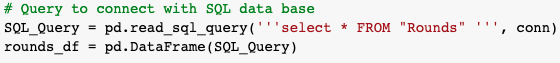

- Verify the type of data contained in the table.

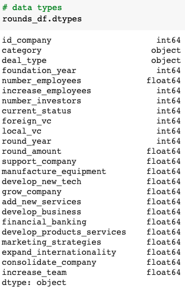

- Validate the number of nulls per row.

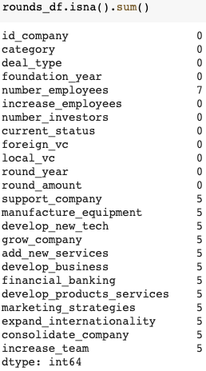

- Obtain the count of each of the columns.

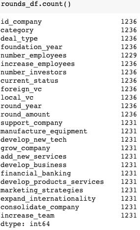

- Remove the rows where all the columns are nulls.

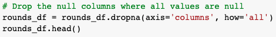

- Transform the category variables.
- Include 0 in the null values.
- Transform variables to integer or float according to their nature.

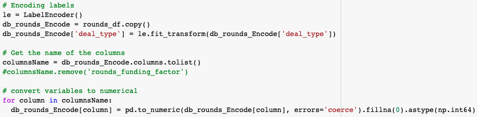

- Validate the integer transformation.

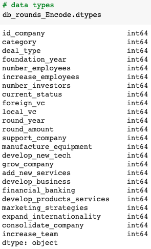

- Validate no null existance.

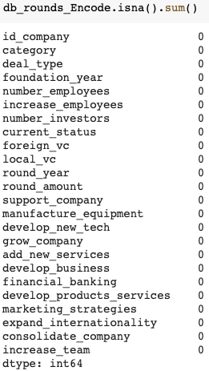

- Count how many row the data frame left.

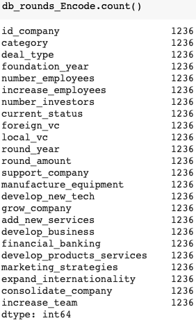

For the companies table, it was necessary to exclude the "mean_**" columns from the integer transformation, so regular expressions were used to exclude the names starting with "mean" from the list of column names used in the loop transformation. 

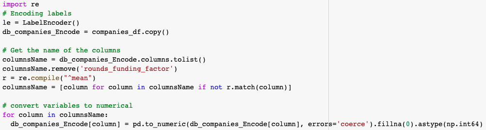

