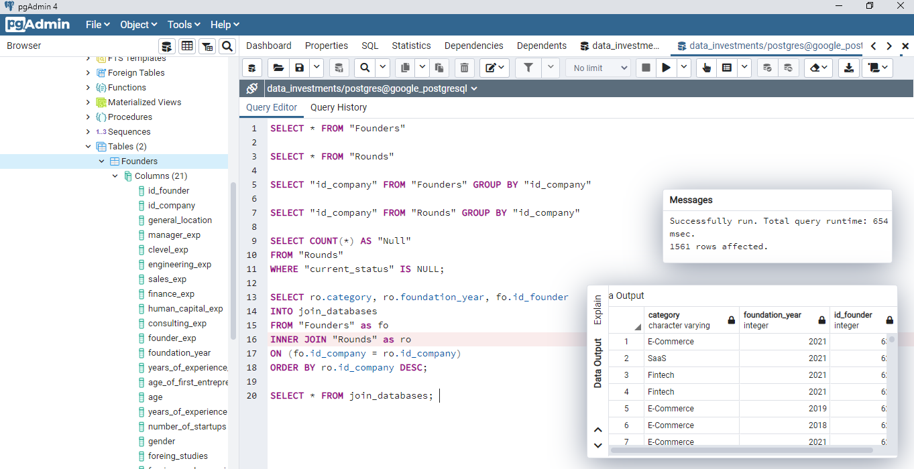
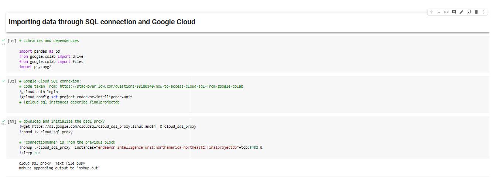
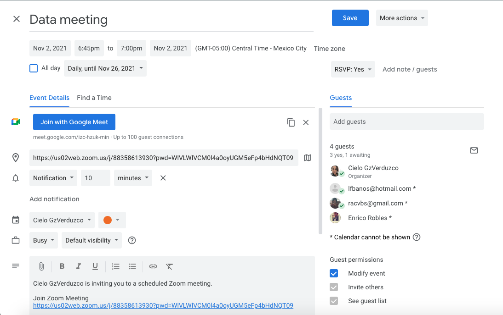
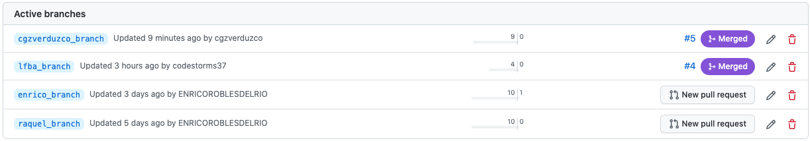

# Database Integration 

For database storage, the team decided to use Google Cloud SQL and Postgres to create and manipulate the data frame.

For this purpose, `Google Colab` and `Google Cloud SQL` [documentation](https://cloud.google.com/sql?utm_source=google&utm_medium=cpc&utm_campaign=latam-MX-all-es-dr-BKWS-all-all-trial-p-dr-1009897-LUAC0015906&utm_content=text-ad-none-any-DEV_c-CRE_536282977853-ADGP_Hybrid%20%7C%20BKWS%20-%20PHR%20%7C%20Txt%20~%20Databases_SQL-KWID_43700065338783015-kwd-1394586267078&utm_term=KW_sql%20google-ST_SQL%20Google&gclid=CjwKCAiAm7OMBhAQEiwArvGi3BeqrWxq0BMSJV2Nyq7-i0oiingXdsJU1NAEy7h6d5eDB4yop3ELkRoC2oUQAvD_BwE&gclsrc=aw.ds) were analyzed to set the connections and also code found and adapted from `Stack Overflow`. 

First, two tables were created at pgAdmin to set our data frame, one was created for Founders Demographics and the other was set for their companies performance, in accordance with the ERD with the following relationships: 

A few examples of queries from pgAdmin are included for further information, including an Inner join between tables:

Using [Psycopg2](https://www.psycopg.org/docs/) as the official client library, the connection between the database, Google Cloud and Google Colab was set.  

To protect users, passwords and connection detail a .TXT file was created and accessed through code , making it able to connect the database with   `Psycopg2`:

Finally, the data can be accessed through SQL queries and manipulated easily from `Pandas` at Google Colab:

For further reference see code file [Database_Integration_Connection_SQL.ipynb](/Database_Integration_Connection_SQL.ipynb) included in this repository.

=======
# Final project Data Bootcamp

GitHub Repository for the final project

## Overview

Presentation link:
[First Delivery Presentation](https://docs.google.com/presentation/d/1K-likYbv1rm9tx0FUCvtPsFVDtoFoNSIyFht_ey9abI/edit?usp=sharing)

__________

## Framework SCRUM

We will use the Scrum framework to carry out the project. Raquel will be the Scrum Master of the team.

## Meetings calendar

We will use the zoom for daily scrum meetings, weekdays from 6:45 pm to 7:00 pm

## Team branch

Each member of the team create personal branch on Github

______________

## Table fields review

The database fields are reviewed with the mockup fields. Type and name.

## Mockups table

_______________
_______________

=======
## Preprocessing

[Go to Preprocessing Resume](Preprocessing.md)

=======
# Description of cleaning data
The connection to the postgress database was made to google colab.

In each of the tables (Founders and Rounsds) the following steps are performed:

- Put the SQL table in a DataFrame.

- Verify the type of data contained in the table.

- Validate the number of nulls per row.

- Obtain the count of each of the columns.

- Remove the rows where all the columns are nulls.

- Transform the category variables.
- Include 0 in the null values.
- Transform variables to integer or float according to their nature.

- Validate the integer transformation.

- Validate no null existance.

- Count how many row the data frame left.

For the companies table, it was necessary to exclude the "mean_**" columns from the integer transformation, so regular expressions were used to exclude the names starting with "mean" from the list of column names used in the loop transformation. 

