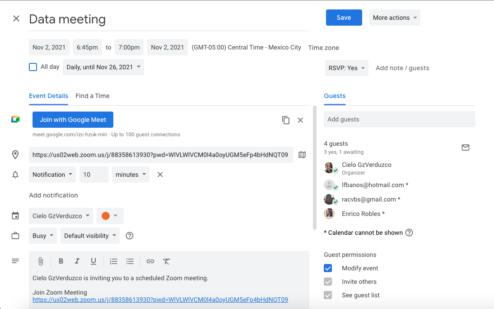
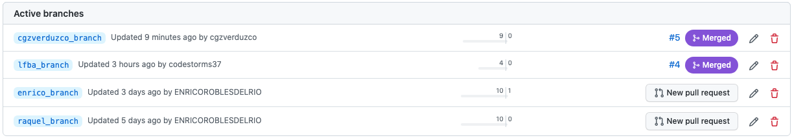

# Team Organization

[Back to README](README.md)

## Framework SCRUM

We will use the Scrum framework to carry out the project. Raquel will be the Scrum Master of the team.

## Meetings calendar

We will use the zoom for daily scrum meetings, weekdays from 6:45 pm to 7:00 pm

## Team branchs

Each member of the team create personal branch on Github

[Back to README](README.md)