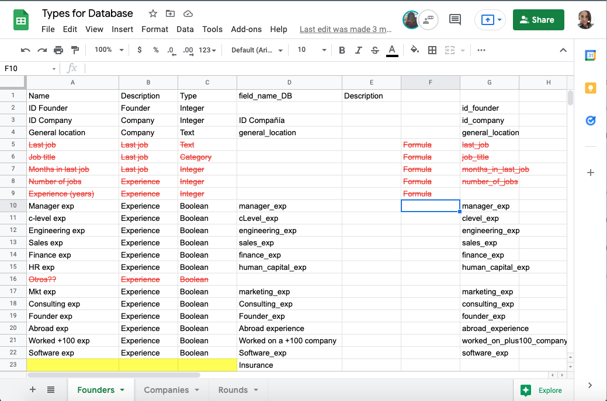
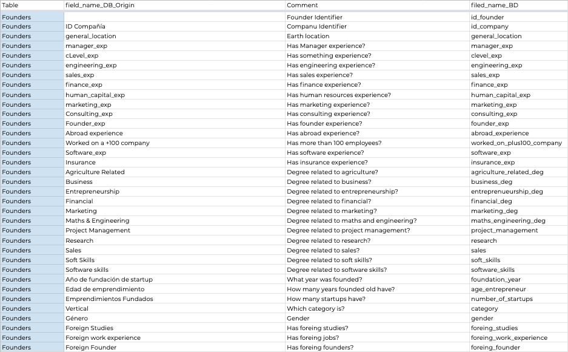
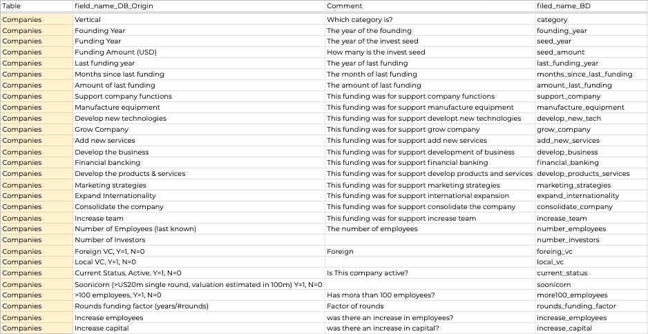
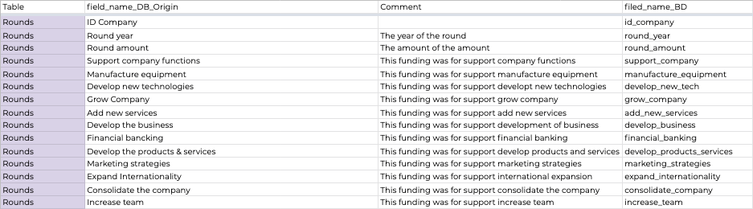

# Data Muckups

[Back to Index](README.md#index)

## Table fields review

The database fields are reviewed with the mockup fields. Type and name.

## Mockup tables

  
  
  

[Back to Index](README.md#index)