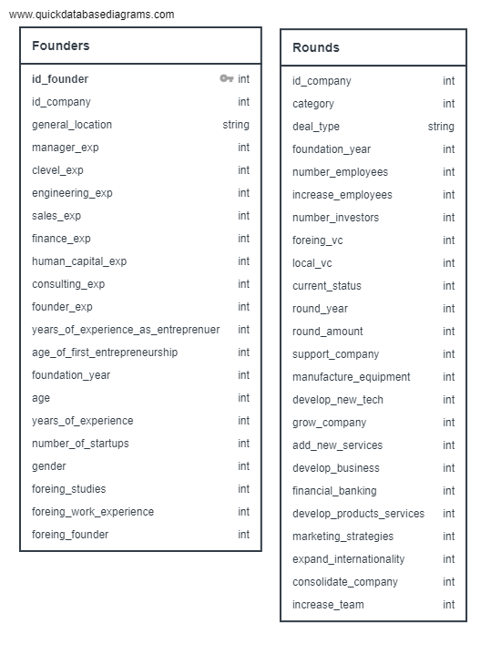
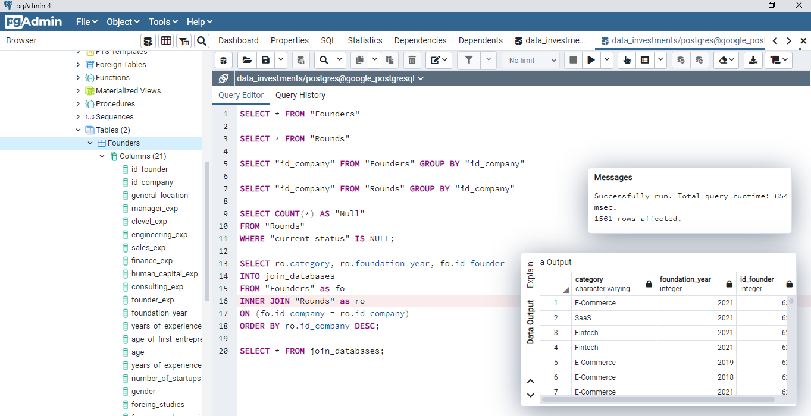
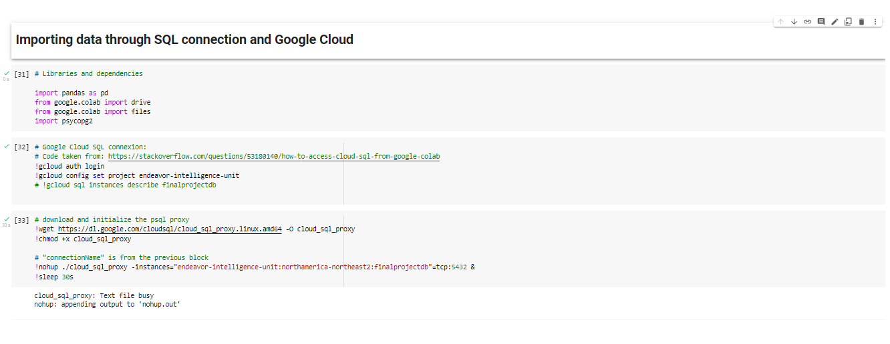
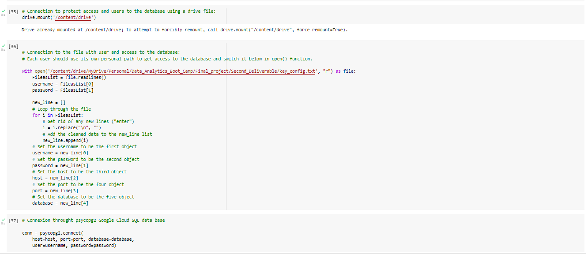
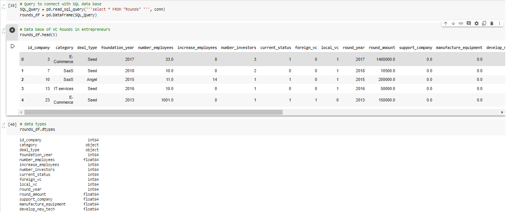

# Database Integration

[Back to README](README.md)

For database storage, the team decided to use Google Cloud SQL and Postgres to create and manipulate the data frame.

For this purpose, `Google Colab` and `Google Cloud SQL` [documentation](https://cloud.google.com/sql?utm_source=google&utm_medium=cpc&utm_campaign=latam-MX-all-es-dr-BKWS-all-all-trial-p-dr-1009897-LUAC0015906&utm_content=text-ad-none-any-DEV_c-CRE_536282977853-ADGP_Hybrid%20%7C%20BKWS%20-%20PHR%20%7C%20Txt%20~%20Databases_SQL-KWID_43700065338783015-kwd-1394586267078&utm_term=KW_sql%20google-ST_SQL%20Google&gclid=CjwKCAiAm7OMBhAQEiwArvGi3BeqrWxq0BMSJV2Nyq7-i0oiingXdsJU1NAEy7h6d5eDB4yop3ELkRoC2oUQAvD_BwE&gclsrc=aw.ds) were analyzed to set the connections and also code found and adapted from `Stack Overflow`.

First, two tables were created at pgAdmin to set our data frame, one was created for Founders Demographics and the other was set for their companies performance, in accordance with the ERD with the following relationships:

A few examples of queries from pgAdmin are included for further information, including an Inner join between tables:

Using [Psycopg2](https://www.psycopg.org/docs/) as the official client library, the connection between the database, Google Cloud and Google Colab was set.  

To protect users, passwords and connection detail a .TXT file was created and accessed through code , making it able to connect the database with   `Psycopg2`:

Finally, the data can be accessed through SQL queries and manipulated easily from `Pandas` at Google Colab:

For further reference see code file [Database_Integration_Connection_SQL.ipynb](/Database_Integration_Connection_SQL.ipynb) included in this repository.

[Back to README](README.md)