# Preprocessing

- The following notes gives an overview of data preprocessing

[Back to Index](README.md#index)

## 1. Setup and Libraries

- Relevant libraries used: numpy, pandas, sklean, google.colab, psycopg2
- Create Google Cloud SQL Connection
- Read key_config.txt for server parameters

## 2. Check of Companies

- Before data cleaning the total Companies that coincide in the Rounds and Founders tables is obtained to validate if some information is loosed in the cleaning process

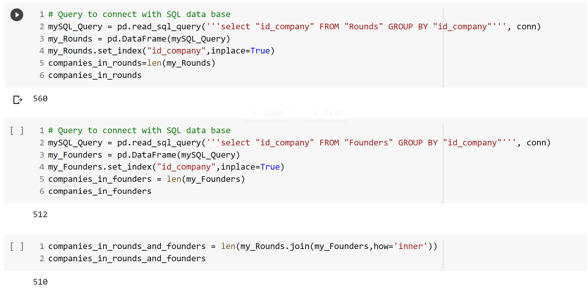

## 3. Rounds Table Data Cleaning

- Check NaNs
- Drop the null columns where all values are null
- Define deal_type Encoding Function (for ordering purposes)
- Create id_deal_type using lambda
- Encode each column, change data type to int64, and fill NaNs with 0

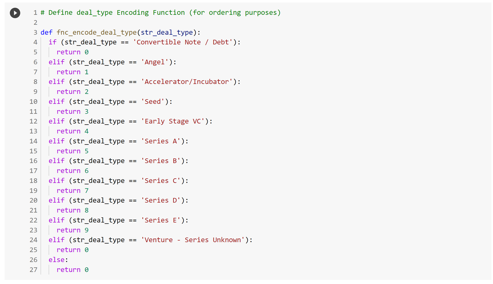

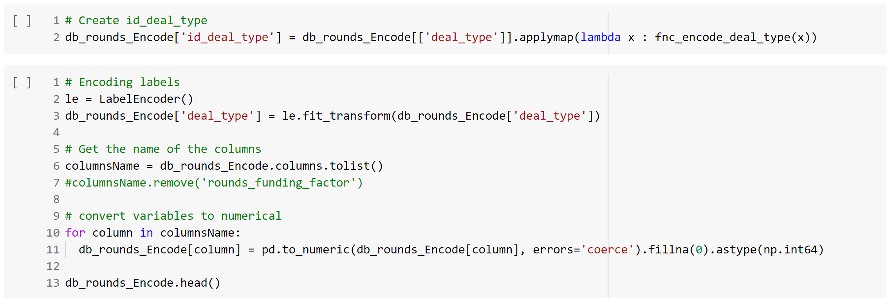

## 4. Rounds Preprocessing, 1st Stage (Current Info / Success)

- Obtain Basic Companies Info (Current Info) from Rounds Table as:
  - Id, category, foundation year, current status, current number of employees, current number of investors
  - Seed round (year and amount)
  - Last round (year and amount)
  - Years since last funding
  - Current number of employees
  - Current number of investors
  - Average years per round
- Define success in terms of:
  - Had a funding round of more than $20 Million USD (Soonicorn)
  - Having 50 or more employees
  - Having 100 or more employees

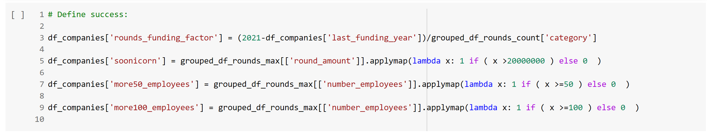

## 5. Rounds Preprocessing, 2nd Stage (Data at Decision Point)

- The **Decision Point (dp)** is the moment when the VC usually is considering to invest in a new company that is **before a C Series Round**
- Therefore, the Rounds Data Frame is filtered to obtain only the rounds Before the decision point
- From the df_rounds_filtered (Rounds at decision point) the following indicators are obtained
  - Decision point Year
  - Rounds count
  - Sum of rounds amount
  - Max amount

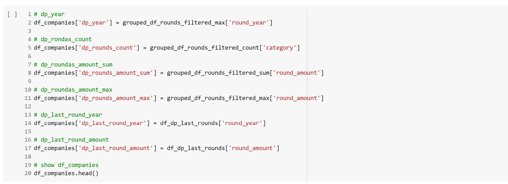

## 6. Founders Table Data Cleaning

- Check NaNs
- Drop the null columns where all values are null
- Encode general location (string)
- Encode all the rest of columns, change data type to int64, and fill NaNs with 0

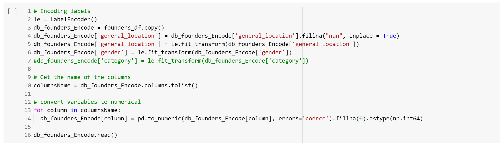

## 7. Founders preprocessing

### First calculate data at decision point (dp)

Example:

First Employment Year

- df_founders['first_employment_year'] = 2021-df_founders['years_of_experience']

Decision point years of experience

- df_founders['dp_years_of_experience'] = df_founders['dp_year'] - df_founders['first_employment_year']

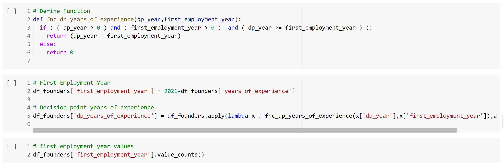

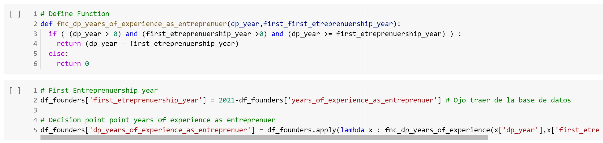

### Obtain max, sum, and mean of all variables

As some companies have more than one founder the max, sum and means of the following variables are obtained to use them as inputs to the model.

- Variables
  - manager_exp
  - clevel_exp
  - engineering_exp
  - sales_exp
  - finance_exp
  - human_capital_exp
  - consulting_exp
  - founder_exp
  - number_of_startups
  - gender
  - foreing_studies
  - foreing_work_experience
  - foreing_founder
  - dp_years_of_experience
  - dp_years_of_experience_as_entreprenuer

## 8. Integrate Info from Founders to Companies Data Frame

- Max, sum, and means indicators are integrated to the Companies Data Frame

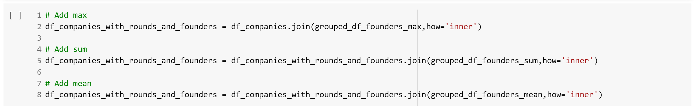

## 9. Create Table in PostgreSQL

- Drop the existing table "companies" in PostgreSQL
- Create the table
- Insert the data into de table.

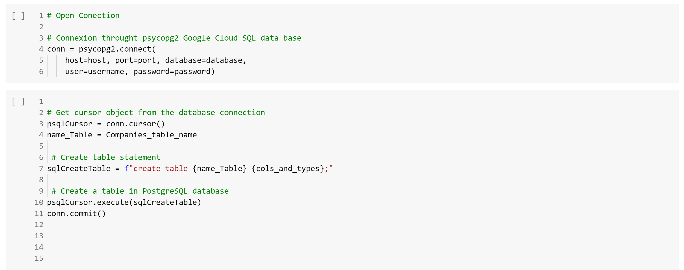

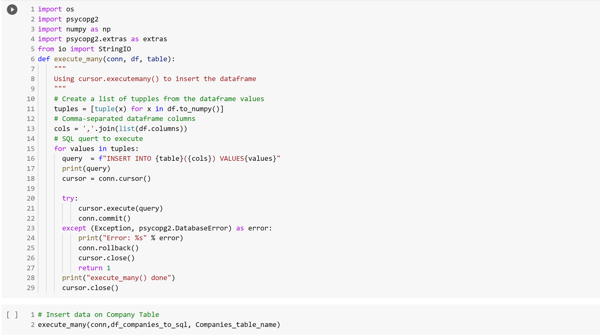

For further reference see code file [Data_Preprocessing_Company_Table_V02.ipynb](./Resources/code/Data_Preprocessing_Company_Table_V02.ipynb) included in this repository.

[Back to Index](README.md#index)
