# Description of cleaning data

[Back to Index](README.md#index)

The connection to the postgress database was made to google colab.

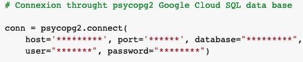

In each of the tables (Founders and Rounsds) the following steps are performed:

- Put the SQL table in a DataFrame.

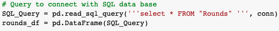

- Verify the type of data contained in the table.

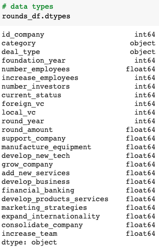

- Validate the number of nulls per row.

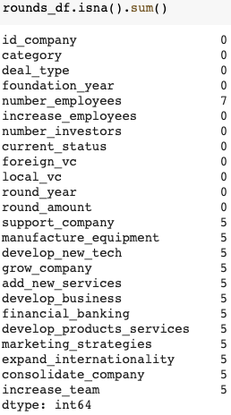

- Obtain the count of each of the columns.

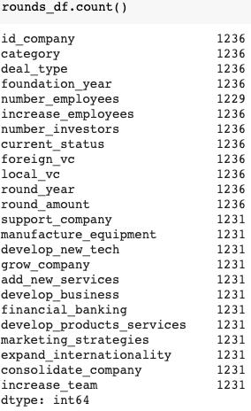

- Remove the rows where all the columns are nulls.

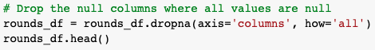

- Transform the category variables.
- Include 0 in the null values.
- Transform variables to integer or float according to their nature.

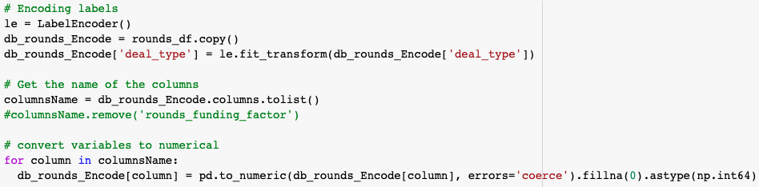

- Validate the integer transformation.

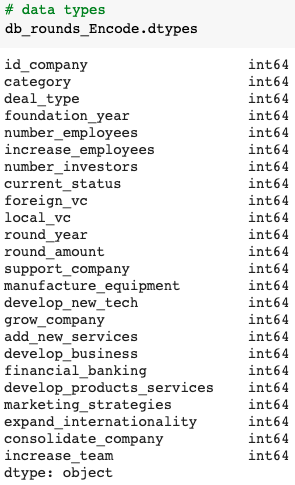

- Validate no null existance.

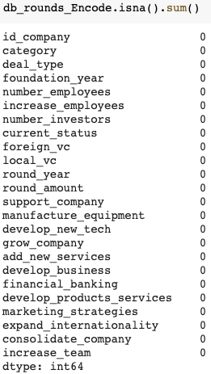

- Count how many row the data frame left.

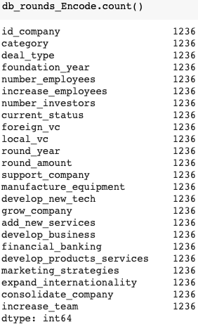

For the companies table, it was necessary to exclude the "mean_**" columns from the integer transformation, so regular expressions were used to exclude the names starting with "mean" from the list of column names used in the loop transformation.

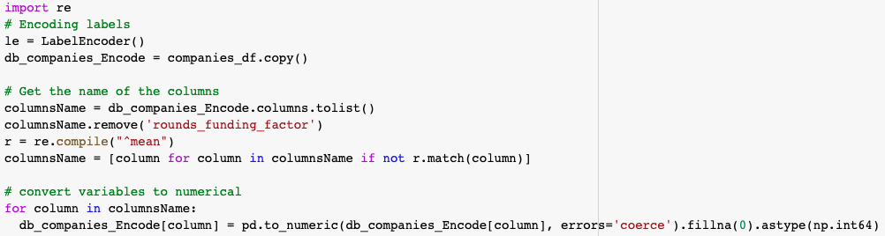

For further reference see code file [Database_Integration_Connection_SQL.ipynb](./Resources/code/cleanData.ipynb) included in this repository.

[Back to Index](README.md#index)
