# Neuronal networks

[Back to Index](README.md#index)

## Pros

    - They are versatile as they can be applied to both regression and classification problems.
    - They are good for modeling with nonlinear data with a large number of inputs.
    - They can be trained with any number of inputs and layers.

## Cons

    - The customer's explanation is difficult to make
    - They usually present over-fitting and generalization

## Data processing

The data frame is adapted to the neural network model, removing the columns with maximum and mean variables. Transforming those defined by years to categorical ones.

### 1. Import libraries

### 2. Select category columns

### 3. Drop category columns (Mean, max)

### 4. Encode and transform years columns

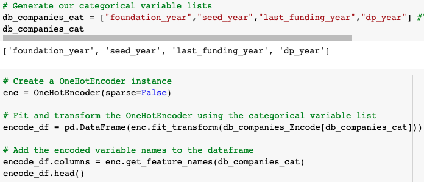

_______________________________

For each Y defined as independent variable, a model of its own is created.

### 5. Slipt data

We divide the data into training, validation, and testing. Using the 70-15-15 ratio.

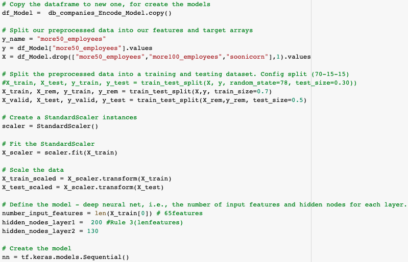

### 6. Structure module

### 7. Create and config layers

### 8. Fit the model

We create a callback function for stopping the Epoch when the accuracy does not improve

### 9. Evaluate results

- ### Unbalanced data
#### Y = +50 employees
- Model: 

    

    

- Confusion Matrix

    

    

    

#### Y = +100 employees

- Model: 

    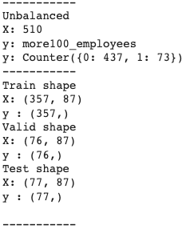

    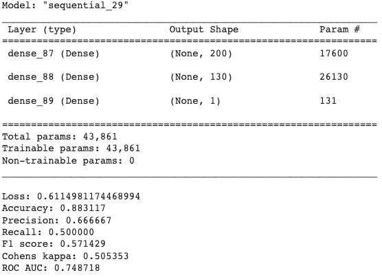

- Confusion Matrix

    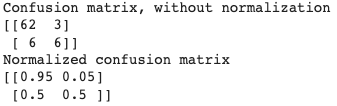

    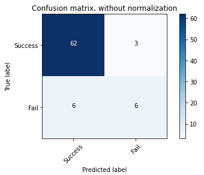

    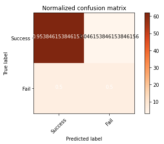

#### Y = soonicorns

- Model: 

    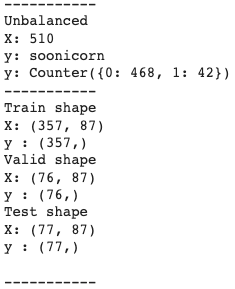

    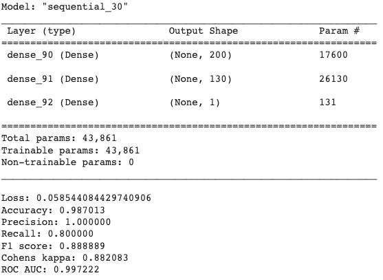

- Confusion Matrix

    

    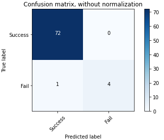

    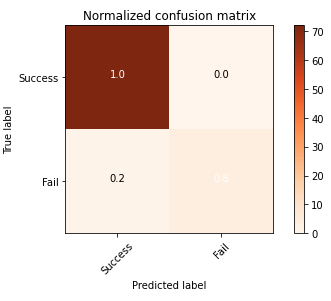

- ### Balanced data

    -  #### Oversampling
#### Y = +50 employees
- Model: 

    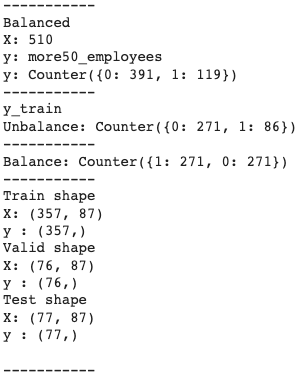

    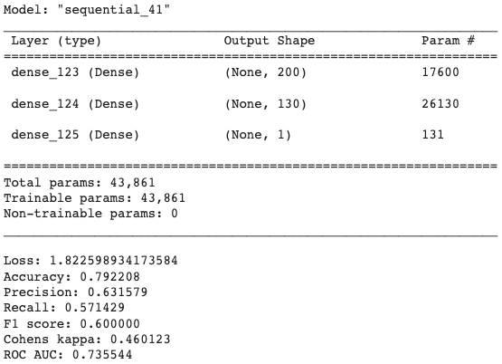

- Confusion Matrix

    

    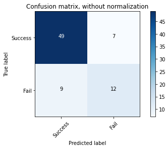

    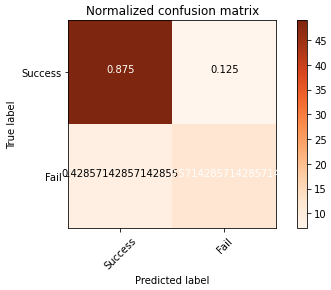

#### Y = +100 employees

- Model: 

    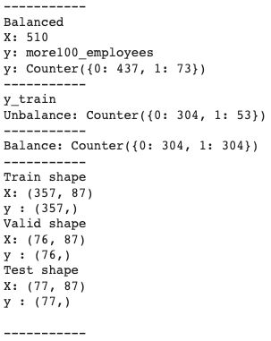

    

- Confusion Matrix

    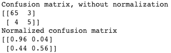

    

    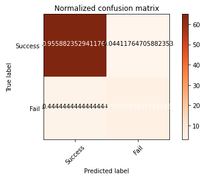

#### Y = soonicorns

- Model: 

    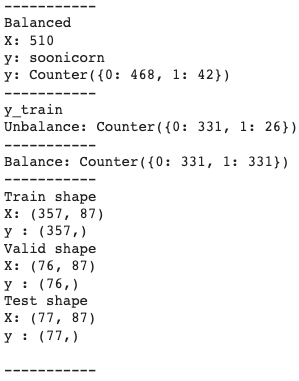

    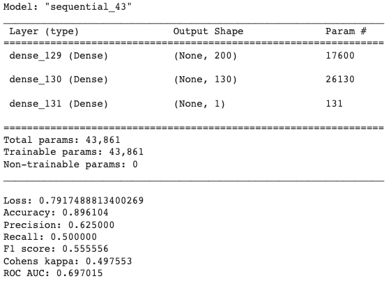

- Confusion Matrix

    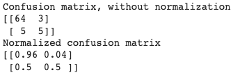

    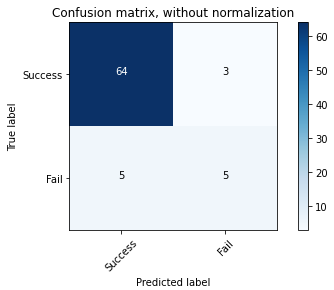

    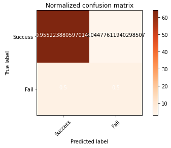

    - #### Undersampling
#### Y = +50 employees
- Model: 

    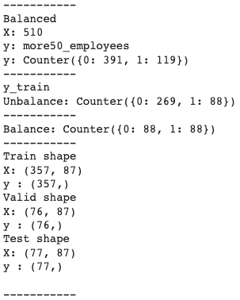

    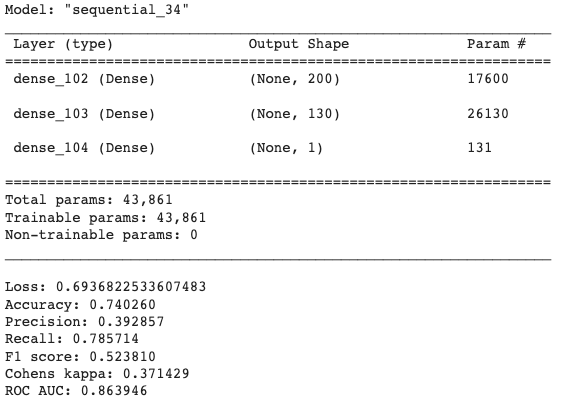

- Confusion Matrix

    

    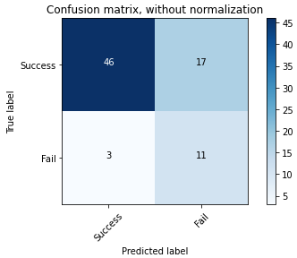

    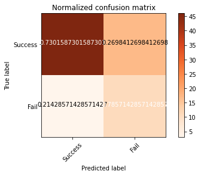

#### Y = +100 employees

- Model: 

    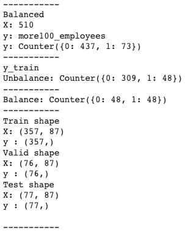

    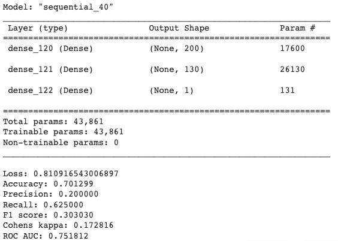

- Confusion Matrix

    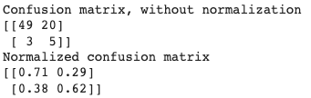

    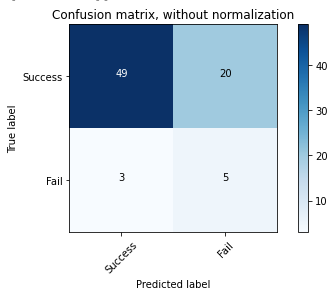

    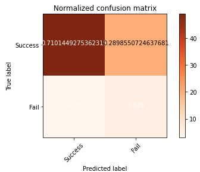

#### Y = soonicorns

- Model: 

    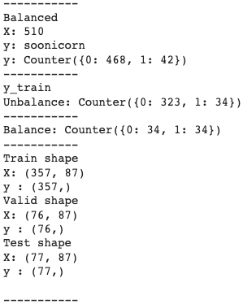

    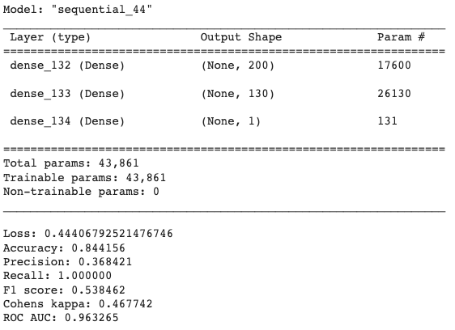

- Confusion Matrix

    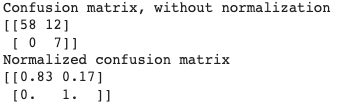

    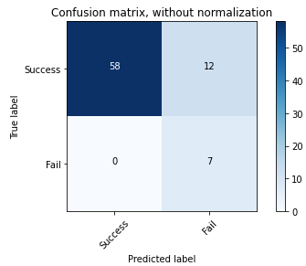

    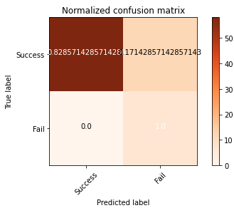

    - #### SMOTE

#### Y = +50 employees
- Model: 

    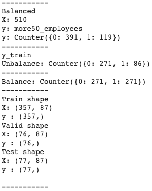

    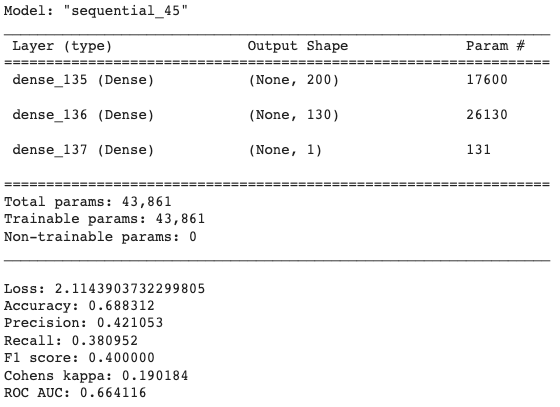

- Confusion Matrix

    

    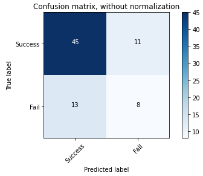

    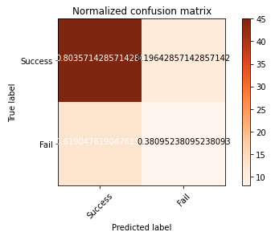

#### Y = +100 employees

- Model: 

    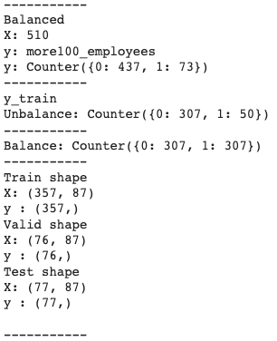

    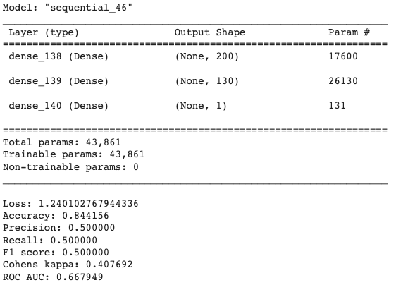

- Confusion Matrix

    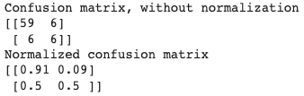

    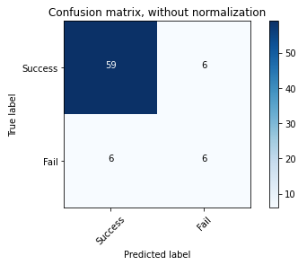

    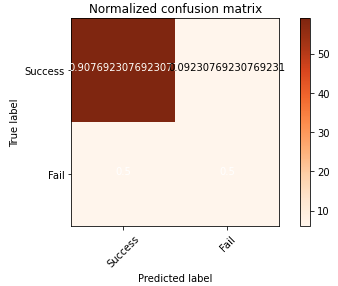

#### Y = soonicorns

- Model: 

    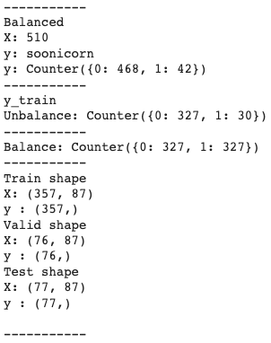

    

- Confusion Matrix

    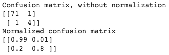

    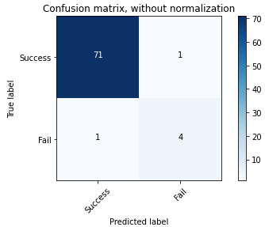

    

For further reference see code file [Machine_Learning_Model.ipynb](./Resources/code/Machine_Learning_Model.ipynb) included in this repository.

[Back to Index](README.md#index)
