# Principal Components Analysis

[Back to Index](README.md#index)

## Settings

- This is used to define the scenarios that will be analysed

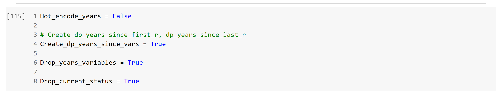

## Libraries and dependencies

- Import of libraries used:
  - numpy
  - matplotlib
  - pandas
  - seaborn
  - sklearn
  - google.colab
  - sqlalchemy
  - psycopg2

## Get Companies Data

- Companies Table is downloaded from SQL server in Google Cloud

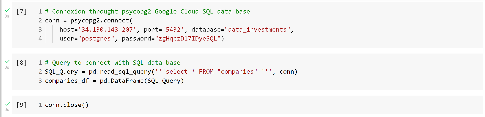

## Cleaning

- Null colums are deleted

## Features Correction

- dp_year and dp_last_round_year art corrected to avoid 0 applying lambda function

## Features Creation

- If is required by the scenario new features are created:
  - dp_years_since_first_r
  - dp_years_since_last_r

## Features Selection

- Mean and Max experience variables are droped in all scenarios
- According to the scenario other variables are droped:
  - foundation_year
  - first_r_year
  - dp_last_round_year
  - dp_year
  - current_status

## Encode

- All remaining category variables are encoded (some are droped before this stage acording to the scenario):
  - foundation_year
  - category
  - first_r_year
  - dp_year
  - current_status
  - dp_last_round_year

## Mahalanobis distance

- Mahalanobis distance is calculated to detect outliers

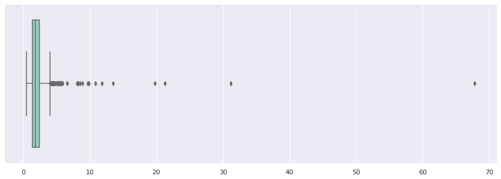

## Drop outliers

- A function to drop outliers according to Mahalanobis distance was defined:

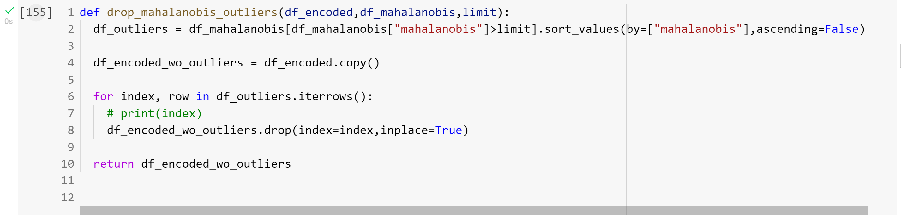

## PCA Scenarios

- A function to obtain the explained variance in many scenarios was defined:
  - To evaluate the effect of droping outliers in different limits
  - To evaluate a range of number of components

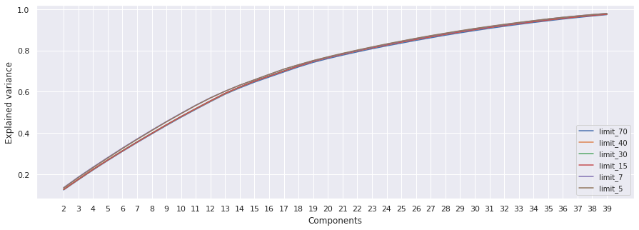

## Running K-means

- K-means evaluation according to selected PCA scenario

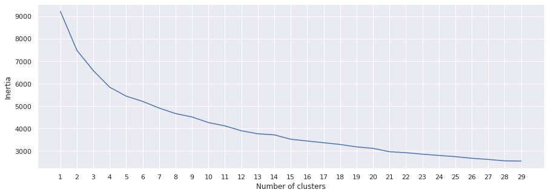

## Clusters Visualization in 2D and 3D

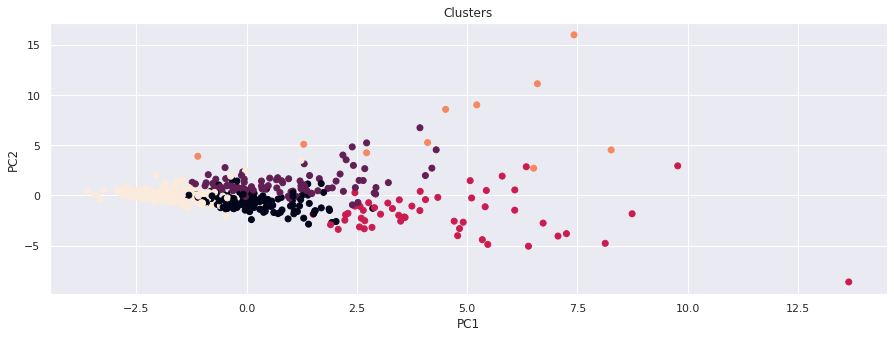

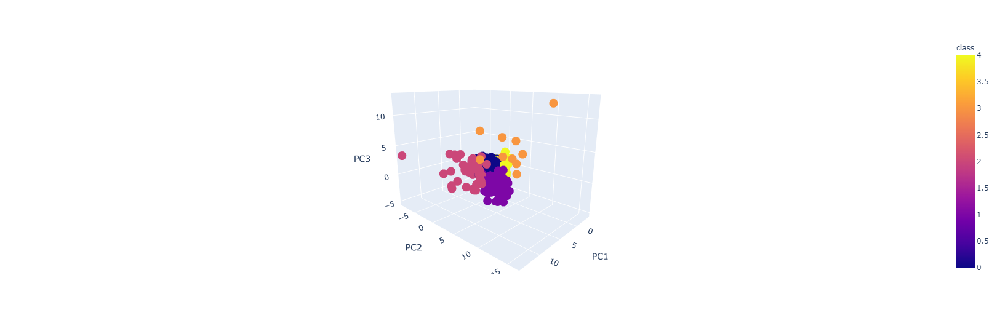


## Y by cluster

```python
import plotly.express as px
df = df_Y_by_cluster
fig = px.bar(df, x="class", y="soonicorn", color="class")
fig.show()
```

### Soonicorns

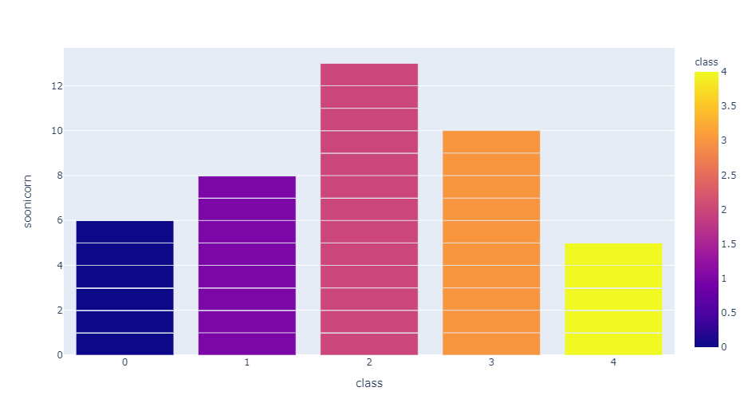

### Companies with more than 50 employees

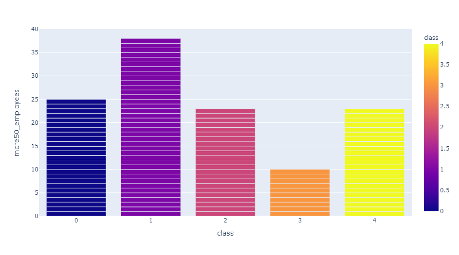

### Companies with more than 100 employees

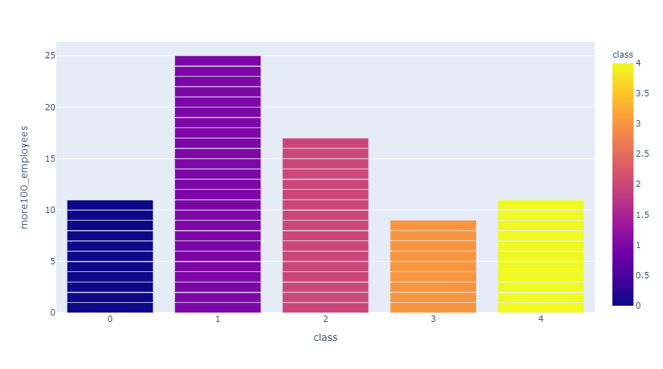

For further reference see code file [Principal_Component_Analysis_V03.ipynb](./Resources/code/Principal_Component_Analysis_V03.ipynb) included in this repository.