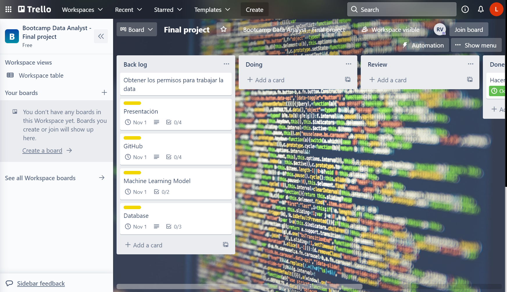

# Work in progress...

## Presentation

- How did you select the model, and why?
- What roadblocks did you encounter (there are always roadblocks!), and how did you solve them?

### Required Content

- Selected topic
- Reason the topic was selected
- Description of the source of data
- Questions the team hopes to answer with the data
- Description of the data exploration phase of the project
- Description of the analysis phase of the project
- Technologies, languages, tools, and algorithms used throughout the project
- Result of analysis
- Recommendation for future analysis
- Anything the team would have done differently
